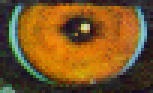
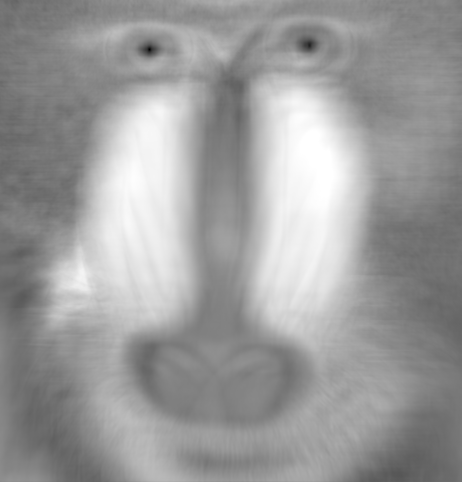
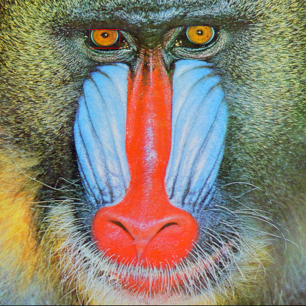

# TemplateMatching

[](https://mleseach.github.io/TemplateMatching.jl/stable/)
[](https://mleseach.github.io/TemplateMatching.jl/dev/)
[](https://github.com/mleseach/TemplateMatching.jl/actions/workflows/CI.yml?query=branch%3Amaster)

TemplateMatching is a Julia package designed to offer a native Julia implementation of
template matching functionalities similar to those available in OpenCV. This package aims
to provide an easy-to-use interface for image processing and computer vision applications,
allowing users to leverage the high-performance capabilities of Julia for template matching
operations. The package offers performance slightly below that of OpenCV but significantly
better than a naive implementation.

## Documentation

Full documentation and description can be found [here](https://mleseach.github.io/TemplateMatching.jl/stable/)

## Installation

To install TemplateMatching, use the Julia package manager.
Open your Julia command-line interface and run:

```julia
using Pkg
Pkg.add("TemplateMatching")
```

## Features

Masks are not yet supported in the current version of the package.
Unlike OpenCV, TemplateMatching.jl supports n-dimensional arrays[^1].

Below is a table summarising available methods and their equivalent in opencv.

| TemplateMatching.jl             | Mask                | OpenCV equivalent      | 
|:--------------------------------|:-------------------:|:-----------------------|
| `SquareDiff`                    | Not yet supported   | `TM_SQDIFF`            |
| `NormalizedSquareDiff`          | Not yet supported   | `TM_SQDIFF_NORMED`     |
| `CrossCorrelation`              | Not yet supported   | `TM_CCORR`             |
| `NormalizedCrossCorrelation`    | Not yet supported   | `TM_CCORR_NORMED`      |
| `CorrelationCoeff`              | Not yet supported   | `TM_CCOEFF`            |
| `NormalizedCorrelationCoeff`    | Not yet supported   | `TM_CCOEFF_NORMED`     |

[^1]: Up to 64 dimensions because of an implementation detail, but this shouldn't be a
problem in most cases.


## Short demo

Full demo can be found [here](https://mleseach.github.io/TemplateMatching.jl/stable/demos/demos/demo.html)

Import necessary packages

````julia
using ImageCore          # Provides core functionalities for image processing
using ImageDraw          # Provides drawing functionalities for images
using TestImages         # Supplies a collection of test images for experimentation

using TemplateMatching
````

Load the mandrill test image.

````julia
img = testimage("mandrill")
````


Extract a specific portion of the image to use as the template.

````julia
template = img[50:80, 150:200]
````


Convert the image and template to arrays of Float32 type, then perform template matching using Normalized Square Difference as the metric.

````julia
img_array = channelview(img) .|> Float32
template_array = channelview(template) .|> Float32

result = match_template(img_array, template_array, NormalizedSquareDiff())
result = dropdims(result, dims = 1)
````

Display the grayscale version of the result; darker areas indicate closer matches.

````julia
result .|> Gray
````


Identify the location of the best match (the smallest value in the case of Normalized Square Difference), then draw a rectangle around on the original image.

````julia
loc = argmin(result)
draw(
    img,
    RectanglePoints(loc[2], loc[1], loc[2] + size(template, 2), loc[1] + size(template, 1)),
    RGB(1, 0, 0)
)
````


## License

TemplateMatching is provided under the [MIT License](LICENSE). 
